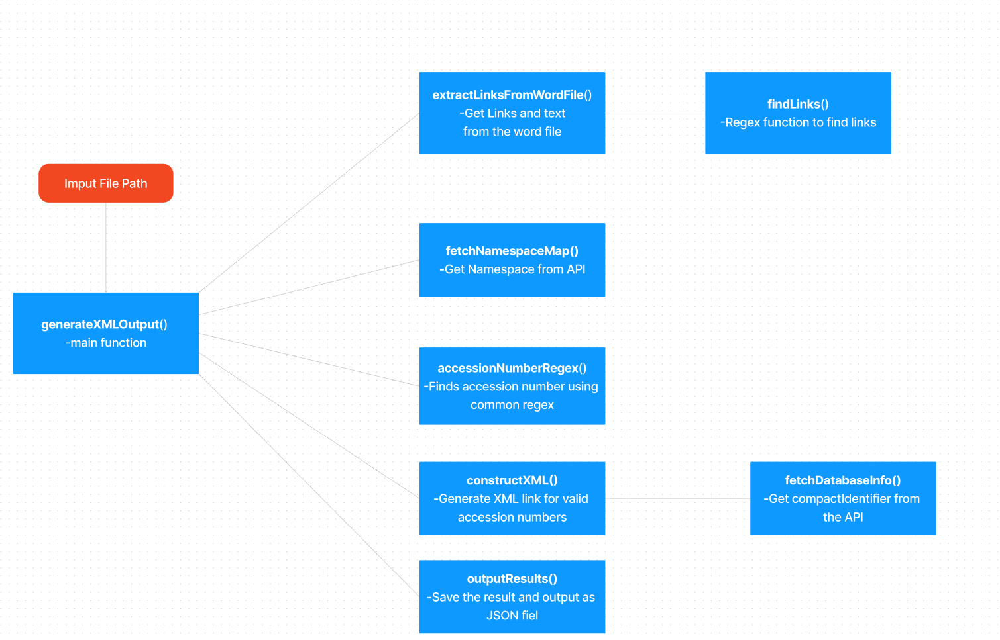

# accession_numbers_identifier

Given a string (consisting of one or more paragraphs) Identify the pattern of the accession number and generate XML data for it

## Steps

    1 - get input Text or file

    2 - find accession numbers

    3- match the accession numbers with given namespace API objects

    4- Identify prefix & construct compact identifier

    5- GET compact Identifier Resolved URL and generate XML Link for it.

    6- Generate XML data for the given input text

    7- Save the data in  JSON file for the

## Functional Dependency Diagram

## Ouput Details

    Output/output.json - contains the JSON data of Accession Number and respective links for the given input text

    Output/result.josn - contains Json data of all the namespaces  for which Accession Number found and respective XML List
